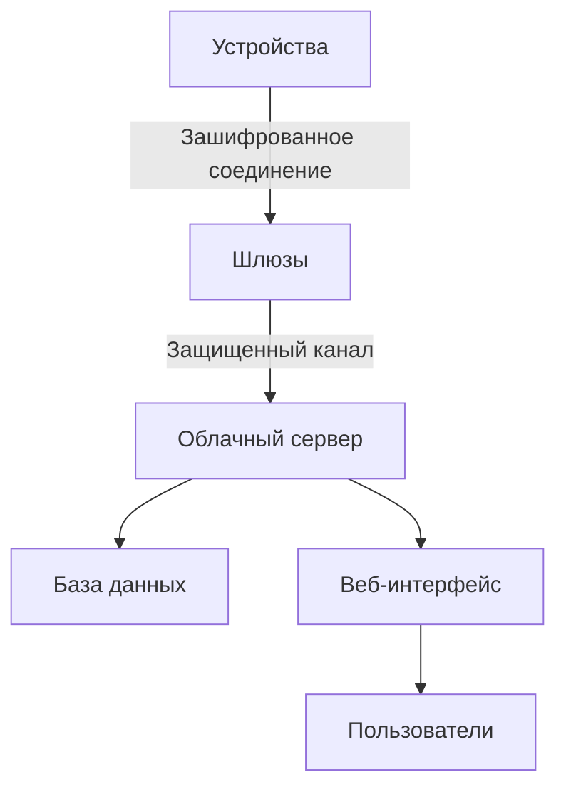
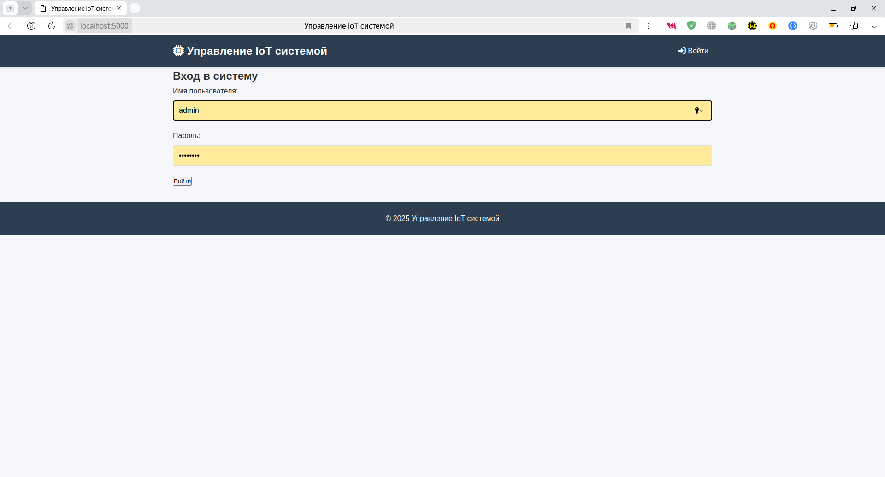
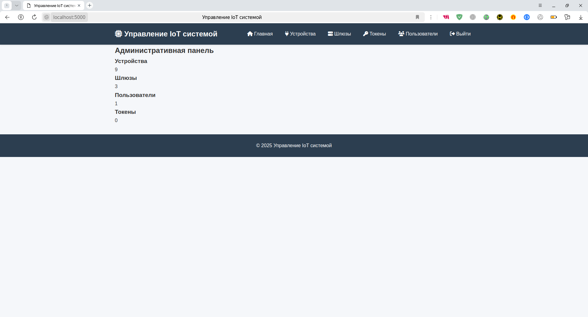
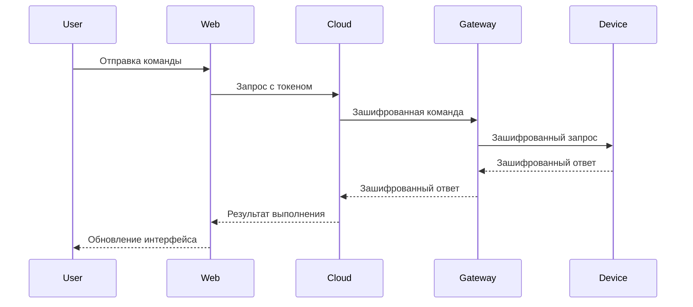

# Secure IoT Management System

Полнофункциональная система управления IoT-устройствами с шифрованием данных на всех уровнях взаимодействия. Реализует безопасное управление устройствами через шлюзы с использованием сессионных ключей и криптографических протоколов.

## Ключевые особенности

- 🔒 **End-to-End Шифрование**:
  - AES-GCM для передачи данных
  - HKDF для генерации сессионных ключей
  - Индивидуальные ключи для каждого устройства
- 🌐 **Многоуровневая архитектура**:
  - Устройства → Шлюзы → Облако → Веб-интерфейс
- 📊 **Панель управления**:
  - Управление устройствами в реальном времени
  - Генерация токенов доступа
  - Мониторинг состояния системы
- ⚙️ **Поддержка устройств**:
  - Лампочки (управление яркостью)
  - Умные замки
  - Датчики температуры/влажности
- 🔐 **Система безопасности**:
  - Механизм обнаружения скомпрометированных устройств
  - Валидация сессионных ключей
  - Защита от MITM-атак

## Технологический стек

**Backend:**
- Python 3.9+
- Flask (веб-интерфейс)
- SQLite (база данных)
- Cryptography (AES-GCM, HKDF)
- Многопоточность

**Frontend:**
- HTML5, CSS3
- Jinja2 шаблоны
- Vanilla JS

## Установка и запуск

1. Клонировать репозиторий:
```bash
git clone https://github.com/nedoletoff/secure-iot-system.git
cd secure-iot-system
```

2. Установить зависимости:
```bash
pip install -r requirements.txt
```

3. Запустить систему:
```bash
python run_system.py --gateways 2 --devices-per-gateway 3
```

**Параметры запуска:**
- `--gateways`: Количество шлюзов (по умолчанию: 2)
- `--devices-per-gateway`: Устройств на шлюз (по умолчанию: 3)

После запуска система будет доступна по адресу: `http://localhost:5000`

**Данные для входа:**
- Администратор: `admin/admin123`
- Пользователь: `user/user123` (создается через админку)

## Архитектура системы



### Компоненты системы:
1. **Устройства**:
   - Умные лампочки (Bulb)
   - Умные замки (Lock)
   - Датчики (Sensor)
   
2. **Шлюзы (Gateways)**:
   - Посредники между устройствами и облаком
   - Управляют сессионными ключами устройств
   - Агрегируют телеметрию

3. **Облачный сервер (Cloud)**:
   - Центральный управляющий компонент
   - Хранит ключи устройств и шлюзов
   - Обрабатывает команды пользователей

4. **Веб-интерфейс**:
   - Панель управления устройствами
   - Администрирование системы
   - Генерация токенов доступа

## Использование системы

### 1. Аутентификация
  
*Экран входа в систему*

### 2. Панель управления

**Для администраторов:**
- Управление устройствами
- Просмотр и создание шлюзов
- Генерация токенов доступа
- Управление пользователями

**Для обычных пользователей:**
- Управление устройствами через токены
- Просмотр состояния устройств
- Контроль параметров устройств

### 3. Управление устройствами
  
*Панель управления устройствами*

- **Лампочки**:
  - Включение/выключение
  - Регулировка яркости (0-100%)
  
- **Замки**:
  - Открытие/закрытие
  - Просмотр состояния
  
- **Датчики**:
  - Чтение температуры
  - Чтение влажности
  - Обновление показаний

### 4. Безопасное взаимодействие


## Особенности реализации

### 1. Криптографическая защита
```python
# Пример шифрования данных
encrypted_data = CryptoUtils.encrypt(
    json.dumps(command).encode(),
    session_key
)
```

- Уникальные ключи для каждого устройства
- Сессионные ключи с ограниченным временем жизни
- AEAD (AES-GCM) для аутентификации и шифрования

### 2. Механизм безопасности
```python
def handle_execute(self, conn, message):
    if self.compromised:
        self.logger.warning("Device compromised, ignoring command")
        return
    # ...код обработки команд...
```

- Автоматическое блокирование скомпрометированных устройств
- Проверка целостности сообщений
- Защита от повторной передачи команд

### 3. Масштабируемость
- Динамическое создание шлюзов и устройств
- Балансировка нагрузки между шлюзами
- Изолированные сессии для каждого подключения

### 4. Мониторинг
- Подробное логирование всех операций
- Визуализация состояния устройств
- Отслеживание последней активности

## Структура проекта

```
secure-iot-system/
├── cloud.py               # Облачный сервер
├── gateway.py             # Шлюзы
├── devices/               # Устройства
│   ├── base_device.py     # Базовый класс устройств
│   ├── bulb.py            # Умные лампочки
│   ├── lock.py            # Умные замки
│   ├── sensor.py          # Датчики
├── web_interface/         # Веб-интерфейс
│   ├── templates/         # HTML шаблоны
│   ├── web_interface.py   # Flask приложение
├── database.py            # Работа с базой данных
├── crypto.py              # Криптографические функции
├── logger.py              # Система логирования
├── run_system.py          # Запуск всей системы
├── requirements.txt       # Зависимости
└── README.md              # Документация
```

## Лицензия

Этот проект распространяется под лицензией MIT. Подробнее см. в файле [LICENSE](LICENSE).

---

**Автор:** Никита Лучкин (nedoletoff)  
**Дата создания:** Июнь 2025  
**Контактная информация:** [nedoletoff@ya.ru](mailto:nedoletoff@ya.ru)  
**GitHub:** [https://github.com/nedoletoff](https://github.com/nedoletoff)  

[](https://opensource.org/licenses/MIT)
[](https://www.python.org/downloads/)

> **Примечание:** Для работы с реальными IoT-устройствами требуется дополнительная адаптация протокола связи и криптографических механизмов под конкретные аппаратные платформы.
